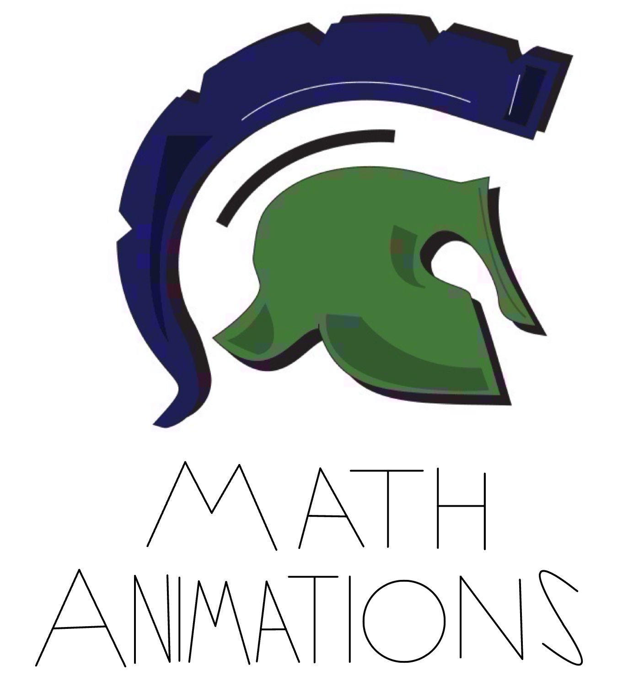

# Manim Math Animations for High School Classrooms


<p align="center">
  <a href="#installation">Installation</a> •
  <a href="#quick-start-for-teachers">Quick Start for Teachers</a> •
  <a href="#why-visual-animations">Why These Animations?</a> •
  <a href="#contributing">Contributing</a>
</p>

> **Concise • Engaging • Mathematically Accurate**

A growing collection of **Manim-powered animations** specifically designed for high school mathematics. In an era where student attention spans are shrinking, these short (usually 15–90 second) animations deliver key concepts quickly and memorably, leaving more class time for discussion, practice, and deeper exploration.

While visual tools are not a replacement for rigorous proof and problem-solving, they serve as powerful **cognitive hooks** that help students grasp ideas instantly and build lasting intuition.

## Current Topics (more added weekly)
- Linear Functions & Slope
- Quadratic Functions & Parabola Properties
- Exponential vs. Linear Growth
- Trigonometric Functions on the Unit Circle
- Systems of Equations (Graphical Solution)
- Pythagorean Theorem Proofs
- Geometric Transformations
- ...and many more coming!

## Why These Animations Work in High School

- **Under 2 minutes** → perfect for bell-ringers, recap, or mid-lesson clarification  
- **Zero fluff** → every frame serves the mathematical idea  
- **Clean voice-over ready** → add your own narration or use silently  
- Fully **open-source & customizable** → adapt to your curriculum, language, or pacing  

## Quick Start for Teachers (5 minutes)

You don’t need to be a programmer! Here’s exactly what to do:

### 1. Install Manim (one-time only)

# **MacOS**
```bash
brew install pyenv ffmpeg
pyenv install 3.11
pyenv global 3.11
pip install manim!

```

# **Windows (10 or 11)**
```bash
1. **Install Python 3.11** (if you don’t already have it)  
   → Download from https://www.python.org/downloads/release/python-31110/  
   → Choose **Windows installer (64-bit)**  
   → ⚡ **IMPORTANT**: check the box “Add Python 3.11 to PATH” before clicking Install

2. **Install FFmpeg** (needed for video export) – easiest method:  
   → Download the latest build from https://www.gyan.dev/ffmpeg/builds/  
   → Click “ffmpeg-release-essentials.zip”  
   → Extract the zip → copy the entire `bin` folder (inside the extracted folder) to `C:\ffmpeg\bin`  
   → Add it to PATH:  
      - Press `Win + X` → System → Advanced system settings → Environment Variables  
      - Under “System variables” find `Path` → Edit → New → add `C:\ffmpeg\bin` → OK all windows

3. **Install Manim**  
   Open **Command Prompt** or **PowerShell** (doesn’t need admin) and run:
   pip install manim

```
# **Linux (Ubuntu/Debian & derivatives)**
```bash
sudo apt update
sudo apt install -y python3 python3-pip python3-venv ffmpeg
pip3 install --user --upgrade pip
pip3 install manim

```
**Verify Installation (any OS)**
```bash
manim --version

```
**Download My Animations!**
```bash
git clone https://github.com/BrandonWilsonProjects/Math-Animations.git
cd YOUR_REPO_NAME

```
**Render any animation**
```bash
# Low-quality preview (instant)
manim -pql scenes/example_scene.py

# High-quality final version (for class)
manim -pqh scenes/example_scene.py
```
## Don’t want to code or install anything? 
→ Just watch or download the videos instantly

All finished high-quality videos are uploaded directly to this repository.

**How to get them in 10 seconds:**

1. Scroll down this page or click a math subject | e.g. `Algebra II` folder  
2. Open any subfolder [unit] | e.g. `Polynomials`, `Sequences`
3. Open `media`  
3. Open `videos` 
3. Open video folders | e.g. `exponentialGrowthDecay/1080p60`, `logarithms/1080p60`  
3. Click the `.mp4` file you want 
3. View Raw
3. Enjoy! 

That’s it — ready to drop straight into PowerPoint, Google Slides, Nearpod, Canvas, etc.

New videos are added here often and always appear here immediately — no installation required!